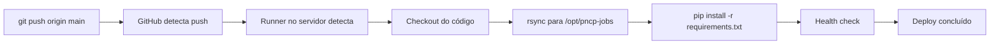

# GitHub Self-Hosted Runner - Sem Necessidade de Secrets

## ⚠️ ATUALIZAÇÃO IMPORTANTE

Este projeto agora usa **GitHub Self-Hosted Runner** ao invés de SSH action.

**Isso significa:**
- ❌ **NÃO precisa mais configurar secrets SSH** (HETZNER_HOST, HETZNER_USERNAME, HETZNER_SSH_KEY)
- ✅ Runner roda localmente no servidor Hetzner
- ✅ Deploy é feito diretamente sem conexão SSH externa
- ✅ Elimina problemas de timeout e firewall

---

## 🔧 Como Funciona Agora

1. **Runner instalado no servidor** (`/opt/actions-runner`)
2. **Runner monitora** repositório GitHub
3. **Quando você faz push**, runner executa o workflow localmente
4. **Deploy acontece** no próprio servidor (sem SSH)

---

## 📋 Configuração Necessária

Ao invés de secrets, você precisa **instalar o runner no servidor**.

### Siga o guia: [RUNNER_SETUP.md](RUNNER_SETUP.md)

**Resumo rápido:**

```bash
# 1. No servidor Hetzner
ssh pncp@135.181.44.221

# 2. Instalar runner
sudo mkdir -p /opt/actions-runner
sudo chown pncp:pncp /opt/actions-runner
cd /opt/actions-runner

# 3. Baixar GitHub Actions Runner
curl -o actions-runner-linux-x64-2.311.0.tar.gz -L https://github.com/actions/runner/releases/download/v2.311.0/actions-runner-linux-x64-2.311.0.tar.gz
tar xzf ./actions-runner-linux-x64-2.311.0.tar.gz

# 4. Obter token no GitHub
# Vá em: https://github.com/SEU_USUARIO/vercel_saas/settings/actions/runners/new
# Copie o comando ./config.sh com o token

# 5. Configurar e instalar como serviço
./config.sh --url https://github.com/USUARIO/vercel_saas --token TOKEN
sudo ./svc.sh install pncp
sudo ./svc.sh start
```

---

## ✅ Vantagens do Self-Hosted Runner

### vs SSH Action (método antigo)

| Aspecto | SSH Action | Self-Hosted Runner |
|---------|------------|-------------------|
| **Secrets necessários** | 3 (HOST, USERNAME, KEY) | 0 |
| **Firewall** | Bloqueado por Hetzner | Sem problemas |
| **Velocidade** | Latência de rede | Local, instantâneo |
| **Configuração** | Chaves SSH complexas | Setup único simples |
| **Timeout** | Comum (i/o timeout) | Nunca |
| **Segurança** | Chave privada no GitHub | Runner local |

---

## 🔍 Verificar Runner Online

1. Acesse: `https://github.com/SEU_USUARIO/vercel_saas/settings/actions/runners`
2. Você deve ver: **pncp-hetzner** com status **Idle** (verde)
3. Se aparecer "Offline", reinicie: `sudo systemctl restart actions.runner.*.service`

---

## 🚀 Fluxo de Deploy



---

## 📚 Documentação

- **Setup completo**: [RUNNER_SETUP.md](RUNNER_SETUP.md)
- **Checklist**: [DEPLOYMENT_CHECKLIST.md](DEPLOYMENT_CHECKLIST.md)
- **Configuração servidor**: [../deployment/HETZNER_SETUP.md](../deployment/HETZNER_SETUP.md)

---

## 🔄 Migração do SSH Action

Se você tinha o deploy configurado com SSH action antes:

1. ✅ **Não precisa remover os secrets** (apenas não serão mais usados)
2. ✅ **deploy.yml já foi atualizado** para usar `runs-on: self-hosted`
3. ✅ **Instale o runner** seguindo [RUNNER_SETUP.md](RUNNER_SETUP.md)
4. ✅ **Faça push** e veja funcionando!

---

**Última atualização**: 2026-02-10 - Migrado para self-hosted runner
